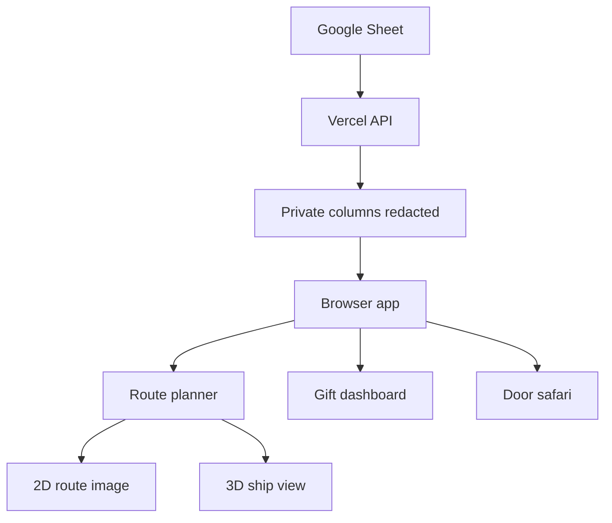
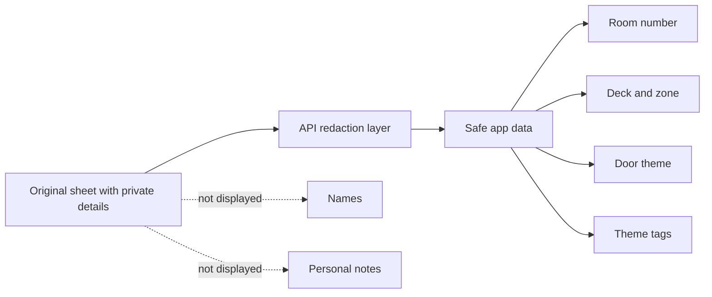
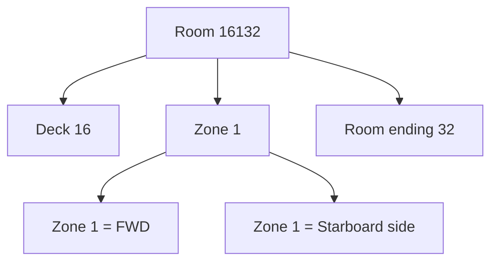
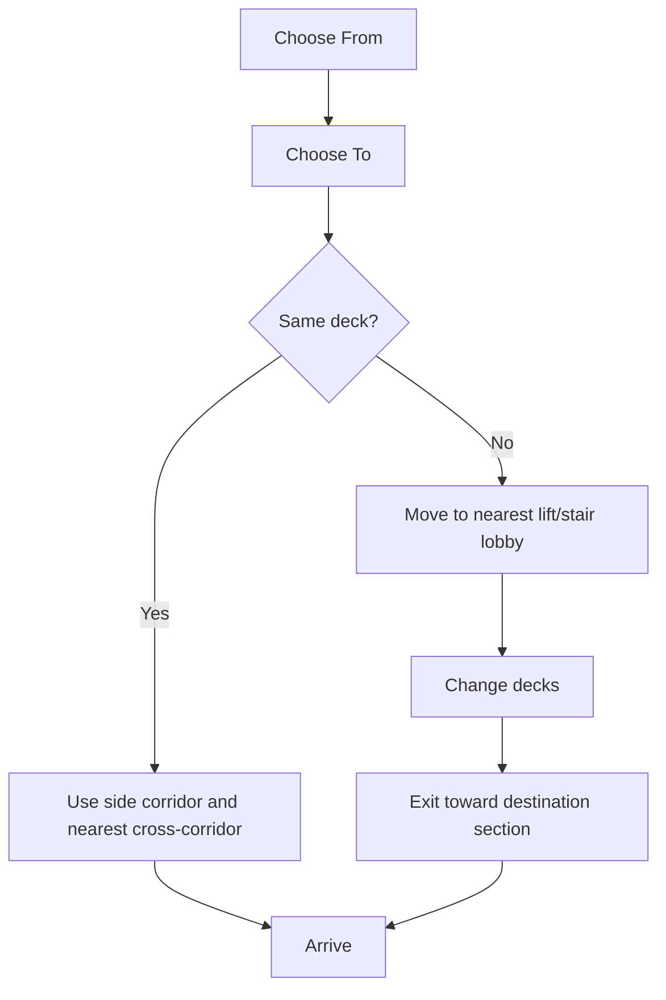

# Pixie Dust Companion

Pixie Dust Companion is a simple cruise helper for planning stateroom deliveries, finding ship locations, preparing themed gifts, and turning door decorations into a light scavenger hunt.

It was built for a Disney Adventure sailing, using deck/zone logic and the ship deck-plan orientation:

- Forward is the front of the ship.
- Aft is the back of the ship.
- Port is the left side when facing forward.
- Starboard is the right side when facing forward.
- Room numbers are read as deck + zone + final two room digits.

Example: `16132` means Deck `16`, Zone `1`, Room `32`.

## Open The App

Use the live version here:

[https://pd-rust.vercel.app](https://pd-rust.vercel.app)

The app is designed for phones first, because it is meant to be used while walking around the ship.

## What You Can Do

### Route

Use Route when you want to know how to walk from one room or ship location to another.

You can choose:

- Stateroom to stateroom
- Stateroom to special location
- Special location to stateroom
- Special location to special location

The route view shows:

- A small 2D route image
- Step-by-step walking instructions
- Deck, zone, side, and section information
- A 3D ship route view
- Delivery progress by deck and section

### Gifts

Use Gifts when preparing Pixie Dust items.

The app groups rooms by safe theme categories such as:

- Princess
- Mickey
- Duffy
- Marvel
- Pixar
- Star Wars
- Stitch
- Birthday
- First cruise
- Anniversary

It does not need to show names to be useful.

### Safari

Use Safari as a door-decoration scavenger hunt.

Each card gives a room, deck, theme, and point value. You can mark doors as found as you walk.

## How The App Works



The app reads room/deck information from a live Google Sheet, but the browser should only receive the fields it needs for routing and themes.

## Privacy Notes

This project intentionally avoids showing personal names in the app.

The live API redacts these columns before the browser receives the sheet data:

- `Names`
- `Preferred characters`
- `Special events`

The bundled backup data in this repository has also been scrubbed.

Important: if the Google Sheet itself is shared publicly, someone with the sheet link may still be able to view the original private data directly in Google Sheets. Keep the source sheet permissions limited, or use a separate public-safe sheet.



## Room Number Logic

The app uses the room number to infer where the room sits on the ship.



Zone guide:

| Zone | Section | Side |
| --- | --- | --- |
| 1 | FWD | Starboard |
| 2 | FWD | Port |
| 7 | FWD | Center |
| 3 | MID | Starboard |
| 6 | MID | Port |
| 9 | MID/AFT center | Center |
| 5 | AFT | Starboard |
| 8 | AFT | Port |

## Route Logic

The route planner uses a practical walking model:



The 3D ship view follows the same route choices as the Route page.

## Updating The Data

For normal use, update the connected Google Sheet. The app will load fresh data when opened.

Safe columns to rely on:

- Deck
- Stateroom number
- Door theme

Private columns may exist in the sheet, but they are not shown by the app after the redaction layer.

## Running Locally

For a quick local preview:

```bash
python3 -m http.server 4173
```

Then open:

[http://127.0.0.1:4173](http://127.0.0.1:4173)

For the closest match to production, use Vercel locally:

```bash
npx vercel dev
```

That runs the static app and the `/api/sheet` redaction endpoint together.

## Deploying

This project is already compatible with Vercel.

To deploy your own copy:

1. Create or fork this repository.
2. Import the repository into Vercel.
3. Deploy.
4. Open the deployment URL on your phone.

There is no build step. The app is static HTML/CSS/JavaScript plus one small serverless API route.

## Files

| File | Purpose |
| --- | --- |
| `index.html` | Main app structure |
| `styles.css` | Visual design and responsive layout |
| `app.js` | Data loading, routing, gifts, safari, and UI logic |
| `ship3d.js` | 3D ship rendering and route path |
| `api/sheet.js` | Google Sheet proxy and privacy redaction |
| `config.js` | Connected Google Sheet URL |
| `data/pd-app-data.json` | Scrubbed backup data |
| `assets/` | App images |
| `vercel.json` | Vercel routing config |

## Safety Checklist Before Sharing

Before sharing the app or repository, check:

- No original spreadsheet file is committed.
- No verification screenshots are committed.
- No private names are visible in the app.
- The Google Sheet is not publicly shared unless it is also scrubbed.
- The repository is private if the sheet URL or context should remain limited.

## Current Live App

[https://pd-rust.vercel.app](https://pd-rust.vercel.app)
